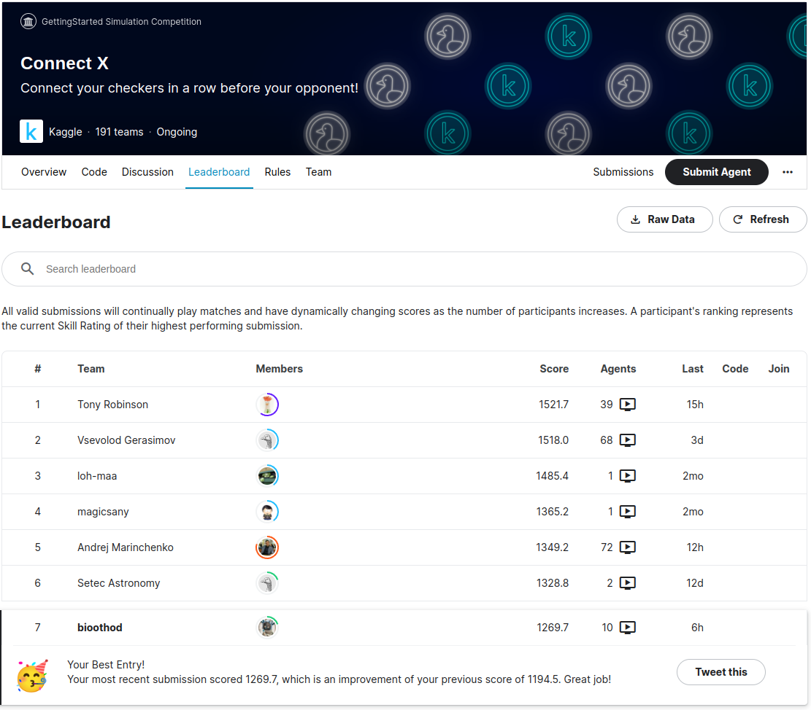

RL algorithms for solving step-by-step games with scalable self-play
and against algorithmic agents.

* working on connectx deep-learning solver which could beat negamax,
  n-step lookahead (3 and 4 steps) and monte-carlo algorithms (all are
  implemented in the tree)
* GPU connectX implementation
* DDQN and PPO implementations suitable for the self-play games
* Current best conv+linear model trained for several days of
  implemented self-play achieves ~1270 score in
  https://www.kaggle.com/competitions/connectx (which is above
  muzero implementation)

